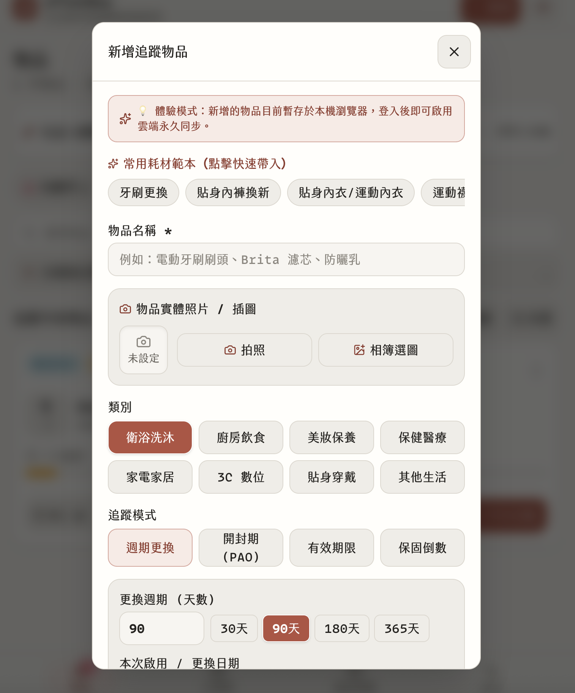

# 補貨日記 · After Buy


> **買了之後，別再忘記換！該換的時候，一眼就知道！**
> 一款手機優先的 Cloudflare 邊緣原生 PWA 生活耗材週期更換、保存期限、保固與備品庫存管理工具。

---


品牌中文名稱為「補貨日記」，英文名稱為 **After Buy**。PWA 安裝圖示採橘底紙卷圖案與中文名稱，頁面的小尺寸品牌標誌使用同款紙卷圖案。


## 🌟 核心特色

1. **五大耗材追蹤模式（含數量耗用率追蹤）**：
  - **數量耗用率追蹤（🆕 Quantity & Burn Rate）**：專門針對深海魚油、維他命 C、垃圾袋、洗衣膠囊、日拋隱形眼鏡、抽取式衛生紙等**「具備容量顆數與每日耗用率」**的消耗品，支援輸入單瓶/單包總容量、每日平均耗用率（支援小數點如 0.5/天）、常用單位快選（顆/錠/包/個/片/入/抽/次/捲）與即時天數試算。卡片支援一鍵「今日已用 (-X 顆)」與「開新瓶」，用盡時自動扣除備品庫存重置滿容量。
  - **週期更換（Cycle）**：牙刷（90 天）、淨水器濾芯（180 天）、冷氣濾網等。
  - **開封保存期（PAO）**：化妝品、保養品、眼藥水等開封後倒數月數。
  - **有效期限（Expiry）**：食品、藥品之固定西元年月日到期日。
  - **保固倒數（Warranty）**：家電、3C 設備原廠保固與購買證明倒數。
  - **擴充常備品項**：深海魚油膠囊、綜合維他命、環保垃圾袋、洗衣膠囊、衛生紙、日拋隱形眼鏡、貼身內衣褲、機車安全帽、印表機墨水、乾電池等。
  - **屬性擴充**：支援記錄「購買金額（Price）」與「規格型號（Spec/Model）」。
2. **「先存放」未拆封管理、「延後提醒 (Snooze)」與「今天已換」5 秒復原機制**：
  - **5 秒觸感復原 (Undo Toast)**：點擊「今天已換」採用樂觀更新，立即於畫面底部安全區彈出 5 秒觸感復原條（支援進度倒數），點擊「復原」瞬間回滾日期、庫存與歷史紀錄，單手滑動誤觸零焦慮。
  - **漸進式揭露 (Progressive Disclosure)**：耗材彈窗首屏聚焦品名、分類/範本、週期與備品等核心決策，照片、規格、金額與存放位置等次要選填欄位收折於抽屜，日常建檔極速流暢。
  - **存放模式 (Stored Mode)**：買了先囤著？勾選「先存放，還沒有要開始使用」，暫不啟動倒數計時。等拆封當天點擊「✨ 開始使用」，自動以當天為起始日啟動追蹤。
  - **延後提醒 (Snooze)**：目前暫時還不想更換？點擊選單「延後 3 天」或「延後 7 天」，貼心守護生活節奏不造成通知疲勞。
  - **存放位置標籤 (Location)**：支援標註衛浴、廚房、臥室、客廳等空間位置，並支援按位置快速篩選。
  - **Inbox Zero 成就卡片**：所有物品都處於最佳狀態時，自動呈現「100% 最佳狀態」祝賀卡片。
3. **多備品庫（Stock Spaces）協作、RBAC 與擁有權轉移**：
  - **空間解耦與多庫管理**：使用者可建立多個獨立的 Stock（例如「甜蜜的家」、「電子木工坊」、「露營設備」），每位使用者可身兼多個空間的擁有者或成員。
  - **「全部備品 (All Stocks)」預設彙整**：首頁與通知預設聚合所有可存取之備品庫，掌握全局狀態，無需頻繁切換導致遺漏更換提醒。
  - **4 級嚴密角色權限控制 (RBAC)**：`owner`（擁有者）、`admin`（管理員）、`member`（一般成員）、`viewer`（僅檢視），杜絕誤觸破壞數據。
  - **原子化轉移擁有權 (Transfer Ownership)**：支援在多成員間移交最高擁有權，移交後原擁有者平滑轉為管理員（Admin），不移出空間。
  - **8 碼邀請碼與分享連結**：管理者一鍵生成 8 碼英數字邀請代碼，支援設定使用上限與有效天數，點擊連結秒加入。
4. **手機拍照建檔（單品直拍 + 批次智慧標籤 + 訪客即開即用）與多選批次操作**：
  - **單品拍照屬性**：新增與編輯物品時支援「相機直拍（`capture="environment"`）」與「相簿選圖」，可即時預覽縮圖與移除。
  - **批次連續拍照建檔**：支援手機後鏡頭連續拍或相簿多選，提供常用範本標籤（內褲、安全帽、墨水等）一鍵秒填，多圖並行上傳至 R2。
  - **訪客零阻礙體驗**：訪客無須登入即可暢玩拍照建檔與本地新增，即開即用零網路報錯。
  - **多選批次打卡**：首頁多選模式結合浮動操作列，支援「🔥 一鍵全部換新（批次更換扣庫存）」、「📦 批次 +1 備品」與「🗑️ 批次刪除」。
  - **採購清單一鍵補貨**：在備品採購頁支援一鍵為所有急需補貨物品批次補庫存。
  - **訪客資料保存與登入帶入**：示範資料可單獨清空或恢復；訪客自行新增的物品（含照片）會保存在本機。登入後可選擇帶入有編輯權限的備品庫，匯入成功的項目不會重複，失敗項目會保留供稍後重試。
5. **多維度視覺體驗（雙視圖看板 + Squircle 月曆矩陣 + 懸浮膠囊導覽島）**：
  - **物品看板雙視圖（2 欄 Grid 網格看板 vs 1 欄 List 管理清單）**：借鏡現代 iOS 卡片美學，Grid 模式提供 24px+ Tabular Bold 之「Hero Metric（已用 X 天／剩餘 Y 天／現存數量）」大數據衝擊力；List 模式提供極致高密度操作與庫存微調。
  - **時程月曆矩陣（Calendar View）**：借鏡訂閱管理月曆，以 7 欄 Squircle 圓角方塊呈現整月排程，當日到期耗材直接顯示專屬縮圖或分類圖示與健康度狀態圓點，多耗材自動標記 `+N` 膠囊；點選日期可於下方展開當日耗材詳情並支援一鍵「今天已換」。
  - **懸浮膠囊導覽島（Floating Capsule Dock）**：告別傳統貼底邊框，採 Apple 原生風格雙側內縮毛玻璃膠囊島，兼具視覺輕盈感與 iOS Home Bar 安全邊界（`pb-safe`）。
6. **字體系統與極速中英雙語系切換**：
  - **原生行動系統字體與等寬數字符號**：採用 iOS / Android 原生系統字型階層（San Francisco / Roboto / PingFang SC / 蘋方黑體），數字與日期全面啟用 `tabular-nums`，排版對齊穩定不再跳動，杜絕外包字型造成的網路阻塞與文字跳閃。
  - **雙語系支援**：原生支援繁體中文（`zh-TW`）與英文（`en`），頂部導覽列與設定頁一鍵切換，零依賴極致輕量，持久化記憶至 `localStorage`。
6. **無密碼雙軌登入（Passwordless）**：
  - **Passkey**：支援 Face ID / Touch ID / Windows Hello 生物辨識一秒極速登入。
  - **Email OTP**：6 位數一次性驗證碼，具備 Cloudflare KV 頻率限制（1 次/分、5 次/天）與新舊帳號自動 Provisioning。
7. **常用耗材範本庫與版本更新通知（Preset Catalog & What's New）**：
  - **即時搜尋與分類耗材庫（Preset Catalog）**：內建 30+ 款台灣家庭最常見生活耗材（含好市多 150 顆 Kirkland 魚油、抽取式衛生紙、垃圾袋、洗衣膠囊、洗碗精、淨水濾芯、冷氣濾網、除濕盒、機車機油等），支援依名稱與備註即時搜尋，支援個人衛浴、廚房飲食、保健醫療、美妝保養等分類快速篩選，支援「一鍵直接加入」或「帶入表單微調」。
  - **版本更新通知彈窗（What's New Modal）**：比照優質 App「這版新增」體驗，平滑彈出新功能重點摘要，並於設定頁提供回顧入口。
8. **全覆蓋分階段通知管道與細緻偏好設定（Multi-Channel Alerts & Settings）**：
  - **細緻化提醒偏好設定**：獨立提供「到期提醒」、「備品庫存提醒」、「用量提醒」三大開關，支援自訂派發時間（如每日 `09:00`）與預設更換前提醒天數（1 / 3 / 7 天）及有效期限提醒天數（3 / 7 / 14 / 30 天）。
  - **Phase 1 (MVP)**：
    - **PWA Web Push**：Service Worker 背景系統通知（桌面 / Android 原生支援；iOS 16.4+ 透過 Safari「分享 → 加入主畫面」即享系統鎖定螢幕橫幅）。
    - **WebCal 日曆同步（推薦）**：RFC 5545 標準 `.ics` 訂閱流，透過穩定 `UID`、遞增 `SEQUENCE`、`STATUS:CANCELLED` 墓碑機制與 **Calendar Token 安全輪替**，確保 Apple/Google 日曆精準更新，零耗電且無舊事件殘留。
    - **Email 提醒**：每日晨間摘要與即將到期提醒。
  - **Phase 2 (VIP 加值)**：
    - **VIP SMS**：高優先級緊急耗材缺貨與到期簡訊（排除 LINE / Telegram）。
8. **行動優先與 Impeccable 頂級設計工藝（Mobile-First & Design Tokens）**：
  - **工作空間即主標題（Primary Workspace Title）**：比照 Notion 與 Apple Reminders 工作區切換體驗，頂部 Header 以當前備品空間（如「🏠 甜蜜的家 ▾」或「📦 全部備品 ▾」）作為主要脈絡標題，徹底擺脫微縮副標題巢狀堆疊的老氣感。
  - **生活狀態一目了然看板（Life Status Hero Overview）**：告別冷硬的資料庫出入庫表格，導入情感化動態看板，一眼掌握「⚠️ X 項需處理」或「✨ 一切就緒 · 良好運作與存放中」，給予使用者清晰心安的視覺反饋。
  - **手機拇指操控區懸浮按鈕（Floating Action Button, FAB）**：於手機螢幕右下角（`bottom-20 right-4`）配置一鍵觸控新增耗材 FAB，避開 iOS 安全區並在批次模式下智慧讓位隱藏，單手持握隨時能新增。
  - **現代 Squircle 卡片與微彈簧觸控手感**：全面採用現代平滑圓角（`rounded-2xl`）、細膩環境微光陰影、膠囊平滑進度軌道，以及大於 44×44pt 拇指操作舒適熱區，手感細膩流暢。
  - **嚴謹排版階層規範（Typographic Scale）**：嚴格收斂全站字級（頁面標題 22px、區塊標題 17px、內文 15px、按鈕 14px、輔助資訊 13px、徽章 12px），搭配數字 `tabular-nums`，排版穩定不再跳動。
  - **語意化雙色主題系統（Theme Design Tokens）**：全站樣式全面綁定語意化 CSS 設計代碼（`--app-*`），光暗對比分明溫潤，杜絕色塊錯亂或文字辨識不清。
  - **單手舒適操作與峰值體驗反饋**：專為單手操作設計的底部導覽列（含 iOS 安全邊界 `pb-safe`）、頂層 Portal 模態抽屜、清楚的生命週期進度條，以及更換與啟用時的愉悅成就感微動效。
  - 常用物品範本提供統一的無品牌生活物品圖片，並支援在物品卡片中顯示自訂實體照片。
9. **AI Agent Skill 整合與個人 API Key（ChatGPT Actions / Claude / Cursor / OpenAPI 3.1）**：
  - **個人 API Key 管理**：在設定頁支援建立、檢視與撤銷加鹽 API 金鑰（`ab_live_<64hex>`，資料庫僅存 SHA-256 雜湊，建立當下一次性顯示），支援 `read_write` 與 `read_only` Scope，並可依備品空間限制存取範圍（`stockId` Scope）。
  - **全維度特殊搜尋與過濾引擎（`GET /api/v1/items`）**：
    - 精準狀態：`status=out_of_stock`（缺貨/備品見底）、`in_stock`（現存備品充足）、`needs_restock`（待採購清單）、`due_today`（今天到期）、`due_soon`（自訂天數窗口）、`quantity_depleted`（使用中容量已空）、`stored`、`snoozed` 等。
    - 獨立備品庫存篩選（`stockStatus: in_stock | out_of_stock | low_stock`），可與任意到期狀態交集複合查詢。
    - 自訂到期窗口天數（`dueWithinDays: 3 | 7 | 14 | 30`）。
    - 台灣業務日時間區間（`dueBefore`, `dueAfter`, `startedBefore`, `startedAfter`）、多欄位排序（`sortBy`, `sortOrder`）與 10 項全局指標回應概要（`summary`）。
  - **強制先驗對齊協定 (Pre-flight Alignment Protocol) 與固定 Canonical URLs**：
    - 固定端點：[`/skill.md`](https://afterbuy.david888.com/skill.md)、[`/llms.txt`](https://afterbuy.david888.com/llms.txt)、[`/llms-full.txt`](https://afterbuy.david888.com/llms-full.txt)、[`/api/v1/openapi.json`](https://afterbuy.david888.com/api/v1/openapi.json)。
    - 要求各類 LLM Agent 在每次會話啟動或操作前，必須先調用 `GET /skill.md` 或 `/openapi.json` 進行能力與搜尋參數對齊，避免使用過期欄位。
  - **語意化 Agent REST API（`/api/v1/*`）**：提供範本庫檢索（`GET /api/v1/presets`）、新增耗材（支援 `presetId` 推薦參數自動帶入）、採購補貨（`POST /api/v1/items/:id/restock` 增減未開封備品）、今日已換（`replace` 自動扣庫存）、記錄用量（`consume` 扣減當前容量）、空間清單等高階操作。
  - **核心概念分明**：明確區分「抽屜裡的未開封備品庫存（`backupStock`）」與「正在使用中的那罐容量（`currentQuantity`）」，支援五大追蹤模式（`cycle` 循環週期、`quantity` 用量耗用率、`pao` 開封保期、`expiry` 有效期限、`warranty` 保固）。
  - **設定頁一鍵產生 Prompt**：提供 ChatGPT Actions 與 Claude / Cursor 專屬 System Prompt 一鍵複製功能，免去手動拼湊提示詞的繁瑣步驟。

---

## ⚡ 技術架構（Cloudflare Edge Native + 地端相容）

- **後端 API**：**Hono** 運行於 **Cloudflare Workers**（冷啟動 0ms，體積 &lt;15KB）。
- **前端 PWA**：**Vite + React 19 + TypeScript + Tailwind CSS**（`vite-plugin-pwa` 離線快取）。
  - 導覽頁採 NetworkFirst，`index.html` 與必要資源可離線使用；新版更新會先提示，避免強制重整中斷表單或訪客照片編輯。
  - 生命週期日期以 `Asia/Taipei` 業務日計算，跨日或回到前景時會重新計算訪客狀態；到期日當天維持「今天到期」，下一個業務日才標記逾期。
  - 所有日期範圍遵守包含結束日規則（例如 `9/1 ~ 9/9` 涵蓋至 `9/9 23:59:59`）；WebCal 全天事件使用下一個業務日作為 exclusive `DTEND`。
- **儲存與邊緣服務**：
  - **Cloudflare D1**：關聯式資料庫（SQLite 核心資料）。
  - **Cloudflare KV**：OTP 暫存與防刷 Rate Limiter、Passkey Challenge、Session 快取。
  - **Cloudflare R2**：物品照片、保固單據、自訂圖示（零流量費出口）。
  - **Cloudflare Scheduled**：每日晨間 08:00 定時排程通知。
- **資料庫 ORM &amp; 地端相容**：
  - **Drizzle ORM**：在 Cloudflare 生產環境綁定 `env.DB`（D1），地端開發環境可無縫切換為本地 SQLite（`local.db`）或 PostgreSQL。

---

## 🌐 GitHub Pages 官方靜態官網 (`docs/`)

本專案於 [`docs/`](./docs/) 目錄內建純靜態、零建置依賴的官方介紹網站（Landing Page），可直接設定為 GitHub Pages 部署來源（Source: `Deploy from a branch` -> `/docs`）：

- **設計與文案靈感**：Apple / iOS 現代頂級工藝美學與 [ExpiresBy](https://expiresby.app/)。
- **核心特色**：
  - **Sticky Header**：支援繁中（`zh-TW`）與英文（`en`）雙語即時切換、深淺色主題切換（☀️/🌙）。
  - **動態 Hero 區塊**：動態平滑切換生活耗材關鍵字、健康度狀態膠囊。
  - **精緻 iPhone 16 Pro 互動 Mockup**：真實模擬「今天已換」5 秒觸感復原條（Undo Toast）、自動扣減備品與真機高解析截圖切換。
  - **6 大核心特色 Grid**：週期與 PAO、一鍵更換扣備品、WebCal 無殘留日曆同步、Passkey 秒登、多管道推播、離線優先 PWA。
  - **視覺計時進度展示條（A color for every countdown）**：四色健康度色相系統（翠綠良好、琥珀即將到期、珊瑚紅今日到期、湛藍備品告急）。
  - **常見問題 Accordion（FAQ）**：解答免費授權、PWA 安裝、日曆防殘留、Passkey 換機、多人空間協作等常見疑惑。
  - **自包含資源**：所有樣式、腳本與圖片皆位於 [`docs/assets/`](./docs/assets/)，開箱即用零 404。

---

## 🤖 LLMs.txt 與 AI Agent 規範支援

本專案原生支援 [llmstxt.org](https://llmstxt.org/) 規範與標準 AI Agent Skill，提供結構化的 Markdown 摘要與完整規格：

- **Agent Skill 規範**：[`/skill.md`](./public/skill.md)
- **OpenAPI 3.1 規範**：[`/api/v1/openapi.json`](https://afterbuy.david888.com/api/v1/openapi.json)
- **快速導覽**：[`/llms.txt`](./public/llms.txt)
- **完整規格與 API 手冊**：[`/llms-full.txt`](./public/llms-full.txt)

---

## 🖼️ OpenGraph 社群分享

已支援 [OpenGraph](https://www.opengraph.to/) 與 Twitter Card 標準：

- **社群分享預覽圖**：[`/og.svg`](./public/og.svg) (1200x630)
- **網頁標籤**：`index.html` 內建完整 `og:title`、`og:description`、`og:image` 與 `twitter:card`。

---

## ⚙️ 已自動初始化的環境變數（.env）

專案根目錄已自動生成具備真實加密金鑰的 [`.env`](./.env) 檔案：

```ini
APP_NAME=補貨日記 | After Buy
APP_ORIGIN=http://localhost:5173
SESSION_SECRET=your_32_character_session_secret_here
CRON_SECRET=your_cron_trigger_secret_here

# 郵件服務 (可選填 Resend，未填寫時系統會在終端機自動輸出 [DEV OTP] 供本地測試)
RESEND_API_KEY=
EMAIL_FROM=補貨日記 <notifications@afterbuy.app>

# Web Push VAPID 金鑰
VAPID_PUBLIC_KEY=your_vapid_public_key_here
VAPID_PRIVATE_KEY=your_vapid_private_key_here
VAPID_SUBJECT=mailto:support@afterbuy.app

# 本地端資料庫
DATABASE_URL=local.db
```

---

## ☁️ Cloudflare 雙帳號部署架構（wrangler.toml）

專案支援多帳號與多環境部署。根目錄的 `wrangler.toml` 已配置原生 Workers Static Assets，並針對兩大獨立 Cloudflare 帳戶（`ai360` 與 `david`）分別綁定專屬之 D1 資料庫、KV 快取與 R2 儲存桶：

```toml
name = "afterbuy"
main = "src/api/index.ts"
compatibility_date = "2024-11-01"
compatibility_flags = ["nodejs_compat"]

# 前端靜態資源託管 (React PWA SPA)
[assets]
directory = "./dist"
not_found_handling = "single-page-application"

[triggers]
crons = ["0 0 * * *"]

# 帳號 1: ai360
[env.ai360]
name = "afterbuy"
account_id = "aa3bf2b79b8bbdbf05b4e289bd7c4d91"
[[env.ai360.d1_databases]]
binding = "DB"
database_name = "afterbuy-db"
database_id = "c682ad96-a780-4428-b7db-b3807dc7e24e"

# 帳號 2: david (DAVID江江江)
[env.david]
name = "afterbuy"
account_id = "379570860738dd1757ba7f67ef2bdffe"
[[env.david.d1_databases]]
binding = "DB"
database_name = "afterbuy-db"
database_id = "d86afa44-8870-44c7-b28d-fc88e1868d01"
```

---

## 🚀 常用指令與雙帳號部署

```bash
# 1. 執行全系統真實端對端整合驗證 (E2E Verification)
pnpm verify

# 2. 執行單元測試
pnpm test

# 3. 啟動前端 Vite 開發伺服器 (包含 PWA 與 API 代理)
pnpm dev

# 4. 建置前端 PWA 生產環境 Bundle
pnpm build

# 5. 部署至指定帳號 (自動先建置前端再發布)
pnpm deploy:ai360   # 部署至 ai360 帳號
pnpm deploy:david   # 部署至 david 帳號
pnpm deploy:all     # 同時部署至兩個帳號

# 6. 遠端 D1 資料庫遷移
pnpm db:migrate:ai360
pnpm db:migrate:david
```

---

## 📜 開源授權

本專案採用 [**GNU Affero General Public License v3.0 (AGPL-3.0)**](./LICENSE) 授權開源。

---

## 📋 專案開發守則

所有參與本專案的 Agent 均需遵守 [`AGENTS.md`](./AGENTS.md) 之鐵律：

- 每次修改必須更新 [`CHANGELOG.md`](./CHANGELOG.md)（以日期 `## YYYY-MM-DD` 為標題，不使用版本號）。
- 重大改進必須同步修訂本 [`README.md`](./README.md)。


